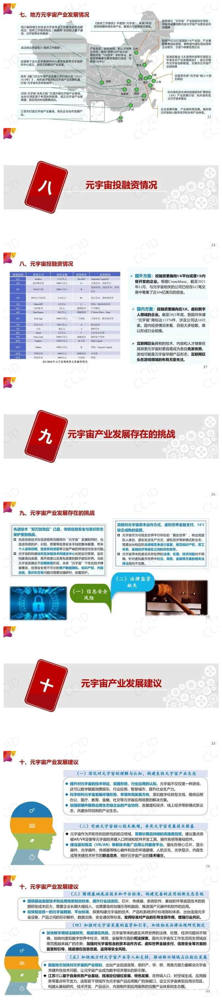

## 元宇宙官网交易平台 元宇宙app官网入口链接分享

作为近期科技圈最热门的话题元宇宙，你对其了解多少？元宇宙的概念最早由美国作家于1992年提出。2021年3月，美国Roblox公司首次将“元宇宙”写进招股说明书，引发了社会各界的关注。2021年10月，Facebook更名为Meta，引发了“元宇宙”概念第二波热潮。很多对元宇宙充满兴趣的朋友在找元宇宙官网交易平台在哪？元宇宙app官网入口链接是多少？为大家推荐一个元宇宙网站——斗极元宇宙（[官方地址点这里](https://demo.metabd.io/)），关于元宇宙的资讯动态这里都应有尽有。

国内外巨头企业纷纷布局元宇宙领域，我国一些地方政府也积极布局元宇宙，上海、武汉、合肥、无锡、杭州、南昌、厦门等地先后提出重点发展元宇宙相关产业。元宇宙成为各界关注热点，新模式新业态不断涌现。

赛迪智库电子信息研究所和江苏省通信学会联合编写了《元宇宙产业链生态白皮书（2022年）》，总结了元宇宙产业发展现状，梳理了元宇宙技术体系与产业链各环节发展情况，分析了各地发展现状、投融资情况和产业发展存在问题，提出了若干措施建议，期望进一步统一产业发展共识，为行业管理部门提供决策参考。

**以下为具体内容PPT:**

